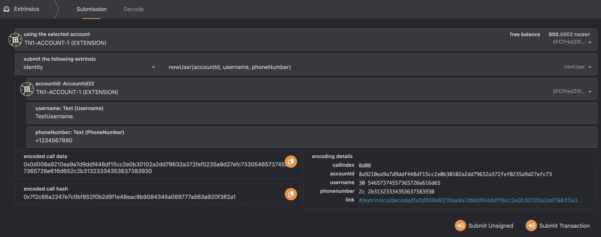
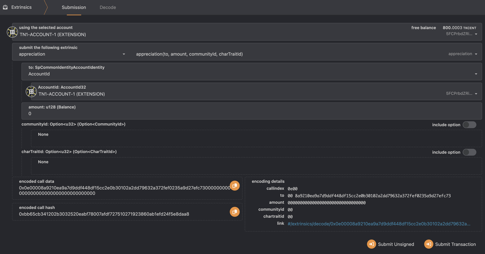
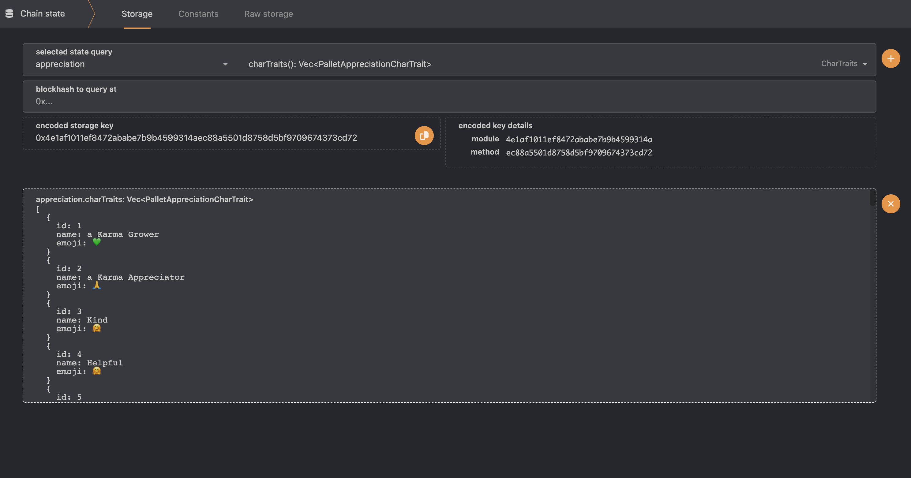
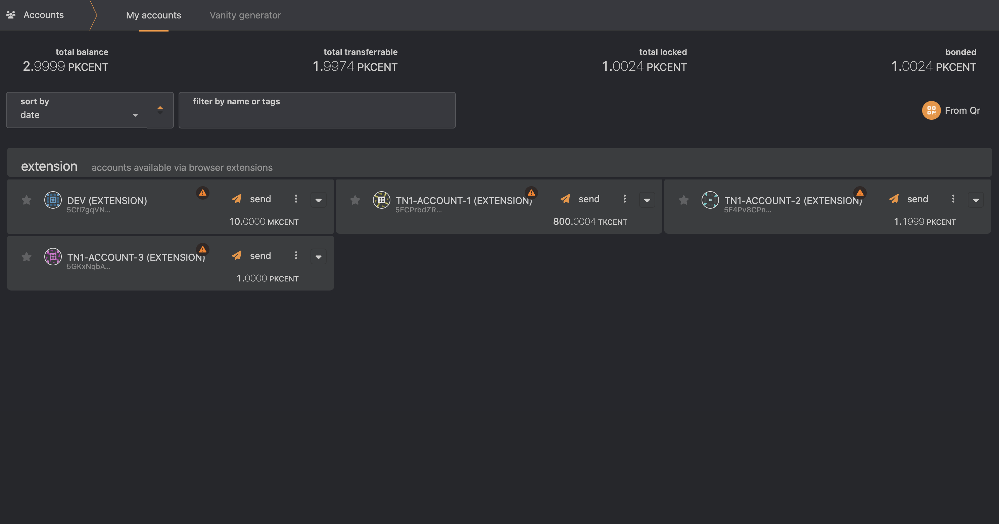
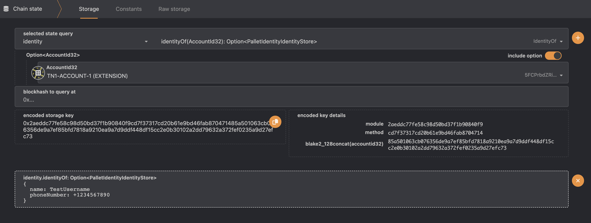

# Basic transactions
This document details the transactions supported by Karmachain 2.0 Testnest1 (TN1).

## Creating an account

You can use any substrate-compatibe wallet but the easiest way to get started is using the polkadot.js chrome extension.

1. Install the [polkadot.js chrome extension](https://chrome.google.com/webstore/detail/polkadot%7Bjs%7D-extension/mopnmbcafieddcagagdcbnhejhlodfdd)
2. Connect to a Karmachain testnet via [polkadot.js](https://polkadot.js.org/apps/?rpc=wss%3A%2F%2Ftestnet.karmaco.in%2Ftestnet%2Fws#/explorer)
3. Follow the instructions in this guide. [Create an Account using Polkadot JS Extension](https://www.youtube.com/watch?v=sy7lvAqyzkY)

---

## Signup Transaction

To sign up, go to `Developer` > `Extrinsics`.
Next, choose from drop down menu `identity` and `newUser`. 

- `using the selected account` - the account which will sign transaction for this user, should match the `accountId` parameter.
- `accountId` - should be same as account used for signing tx
- `username` - your requested Karma Coin user name.
- `phoneNumber` - your requested phone number in international format. e.g. 972549805381

Click `Submit Transaction` to send the transaction. You should see an `ExtrinsicSuccess` message in few seconds.

----

## Appreciation Transaction

- Go to `Developer` > `Extrinsics`.
- Next, choose from drop down menu `appreciation` and `appreciation`. 

- `using the selected account` - account which send appreciation (your account)
- `to` - AccountId, username or phone number of the appreciation's receiver
- `amount` - amount of tip in `KCents`to send with appreciation
- `communityId` - not supported yet. So do not include this option.
- `charTraitId` - appreciation char trait id. For example, 6 for `Awesome`, 7 for `Smart`. Click on the switch to include this option.

Click `Submit Transaction`. You should see an ExtrinsicSuccess message in few seconds.

---

## Available char traits

- Go to `Developer` > `Chain state`. 
- Choose `appreciation` and `charTrait` and click on "+".

You should see list of available character traits.

----

## Account balance

After registration, you can see your account balance in `Accounts` tab.

----

## Account information

- Go to `Developer` > `Chain state`.  
- Choose `identity` and `identityOf` and click on "+".

You should see basic information about account.

----

