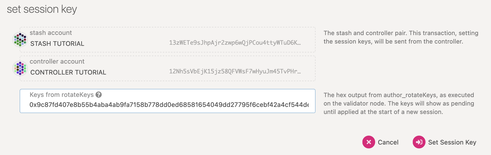

# Running a Testnet Validator Node
This technical guide walks you thorugh the steps of running a validator node on the karmachain 2.0 Testnet 1 (TN1).

## System Requirements
- The specs posted below are not a hard requirement to run a validator, but are considered best practice. 
- Running a validator is a responsible task. Using professional hardware is a must.
- The most common way for a beginner to run a validator is on a cloud server running Linux. You may choose whatever VPS provider that your prefer. As OS it is best to use a recent Debian-based Linux (Debian or Ubuntu).

### CPU
- x86-64 compatible
- Intel Ice Lake, or newer (Xeon or Core series). AMD Zen3, or newer (EPYC or Ryzen)
- 4 physical cores @ 3.4GHz
- Simultaneous multithreading disabled (Hyper-Threading on Intel, SMT on AMD)
- Prefer single-threaded performance over higher cores count
- An NVMe SSD of 500 GB (As it should be reasonably sized to deal with blockchain growth)

### Memory
16 GB DDR4 ECC

### System
Linux Kernel 5.16 or newer

### Network
- Minimum symmetric networking speed of 500 Mbit/s (62.5 MB/s)
- Make sure your system is configured to run NTP to sync its local time

---

## Dev Environment Setup
Running a validator node requires Docker and Git.
* [Docker](https://docs.docker.com/engine/install/)
* [Git](https://github.com/git-guides/install-git)

## Readup on the Release Notes
Read the latest [testnet reelase notes](https://github.com/karma-coin/karmachain/releases/)

## Download Karmachain source code
- Get the latest Testnet release source code from GitHub.
- The latest release is always [available on this page](https://github.com/karma-coin/karmachain/releases/).
- The current latest release is `v0.1.0`.
- Clone the repo and checkout the release tag.

```bash
git clone https://github.com/karma-coin/karmachain
cd karmachain
git checkout tags/v0.1.0 -b v0.1.0
```

## Prepare your node
Build a node docker image.

```bash
docker build . --tag karmachain-node
```

## Run your node
```bash
docker run \
	--name karmachain-node \
	--rm \
	--mount source=chain-data,target=/chain-data \
	-p 30333:30333 -p 9944:9944 -p 9933:9933 \
	karmachain-node \
		--base-path /chain-data \
		--chain chain-spec/chainSpecTN1.json \
		--port 30333 \
		--ws-port 9944 \
		--unsafe-ws-external
		--rpc-port 9933 \
		--rpc-cors all \
		--rpc-methods Unsafe \
		--validator \
		--name <your-node-name> \
		--bootnodes /dns/testnet.karmaco.in/tcp/30333/p2p/12D3KooWFgrbXqQE1kp3ytTGTsgsVVFBp5P3TGYyGa2KaVs9nQta
```

### Create Accounts
- To start validating, you need to create two accounts - a `Stash account` and a `Controller account`.
- The `Stash account` is where you keep most of your coins. It is the custodian of your staking funds.
- The `Controller account` is used to start and stop validation.
- You can use any Substrate-compatible wallet to create these accounts. We recommend using the [polkadot.js extension](https://chrome.google.com/webstore/detail/polkadot%7Bjs%7D-extension/mopnmbcafieddcagagdcbnhejhlodfdd). Reffer to this guide [Create an Account using Polkadot JS Extension](https://www.youtube.com/watch?v=sy7lvAqyzkY) for more information about using the extension.

## Request Coins for your bond
- Join the Karma Coin [Testnet Telegram Channel](https://t.me/karmacoinapp/293).
- The basic accounting unit of Karmachain is `Karma Cents` (KCENTs). One million Karma Cents are 1 Karma Coin.
- The minimum testnet bonding amount is 2500,000,000,000 KCENTS (2.5M Karma Coins).
- Share the public address of you `Stash account` and request testnet KCENTs for your bond.
- Keep most of your funds in the `Stash account` since it is meant to be the custodian of your staking funds and move some coins to your `Controller account` so you can pay transaction fees for transactions from this account.

## Bond Karma Coins
Follow these steps to set up your validator.

- Access the testnet's web app [here](https://polkadot.js.org/apps/?rpc=wss%3A%2F%2Ftestnet.karmaco.in%2Ftestnet%2Fws#/explorer) and complete the steps below in this app.

- Bond coins in your `Stash account`. These coins will will be used as stake for the security of the network and can be slashed. Make sure not to bond your entire coin balance since in that case you will be unable to pay transaction fees from your `Stash account`.

- Select your `Controller account`. This account wil be used by you to decide when to start or to stop validating.

- Go to the Staking section. Click on `Account Actions`, and then the `+ Stash` button.`


- `Stash account` - Select your Stash account. Make sure that your `Stash account` contains at least this much. You can, of course, stake more than this.
- `Controller account` - Select the Controller account created earlier. This account will also need a small amount of KCENTS in order to start and stop validating.
- `Value bonded` - How much KCENTS from the Stash account you want to bond/stake. Note that you do not need to bond all of the KCENTS in that account. Also note that you can always bond more KCENTS later. However, withdrawing any bonded amount requires the duration of the unbonding period.
- `Payment destination` - The account where the rewards from validating are sent. Payouts can go to any account. If you'd like to redirect payments to an account that is neither the controller nor the stash account, set one up. Note that it is extremely unsafe to set an exchange address as the recipient of your staking rewards.
- Next, click `Bond` and sign the transaction with your `Stash account`. You should see an ExtrinsicSuccess message in about a minute.
- Your bonded account will available under `Stashes`. 
- You should now see a new card with all of your accounts (note: you may need to refresh the page). The bonded amount on the right corresponds to the funds bonded by the `Stash account`.


## Generate session keys

Run this command on the same machine that runs your node, while the node is running with the default WS RPC port configured.

```bash
echo '{"id":1,"jsonrpc":"2.0","method":"author_rotateKeys","params":[]}' | websocat -n1 -B 99999999 ws://127.0.0.1:9944
```

The output will have a hex-encoded `result` field. Save this result for a later step.

## Submit a `setKeys` Transaction

You need to tell Karmachain about your Session keys by signing and submitting an extrinsic. This is what associates your validator with your `Controller account`.

Go to `Staking > Account Actions`, and click `Set Session Key` on the bonding account you generated earlier. Enter the output from author_rotateKeys in the field and click `Set Session Key`.




## Validating

The `reward commission percentage` is the commission percentage that you can declare against your validator's rewards. This is the rate that your validator will be commissioned with.

Payment preferences - You can specify the percentage of the rewards that will get paid to you. The remaining will be split among your nominators.

You can also determine if you would like to receive nominations with the `allows new nominations` option.


Click `Validate`.

Navigate to the `Staking` tab, you will see a list of active validators currently running on the network. At the top of the page, it shows the number of validator slots that are available as well as the number of nodes that have signaled their intention to be a validator. You can go to the `Waiting` tab to double check to see whether your node is listed there.

The validator set is refreshed every era. In the next era, if there is a slot available and your node is selected to join the validator set, your node will become an active validator. Until then, it will remain in the waiting queue. If your validator is not selected to become part of the validator set, it will remain in the waiting queue until it is. There is no need to re-start if you are not selected for the validator set in a particular era.

## Summary
We hope this guide got your validator up and running smooothly. 
Please feel free to contact Team Karma Coin if you came acrosss any issue.


